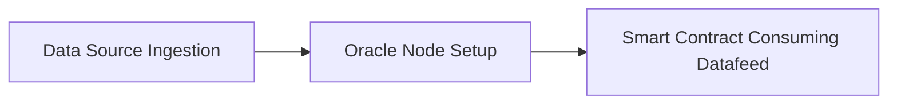

# Chainlink Sample Datafeed End-to-End Process

This project demonstrates Chainlink Datafeed End-to-End Process. It includes collection of repositories with sample  implementation of each step of the process, ranging from initial data source, through processing by chainlink node, until onboarded datafeed consumed in a sample smart contract on blockchain.

## Background

Chainlink is a decentralized oracle network that provides secure and reliable access to off-chain data for smart contracts. It bridges the gap between the blockchain and the real world, allowing smart contracts to access real-time data, such as price feeds, weather data, and sports scores. This enables the development of more complex and powerful DeFi applications, such as decentralized exchanges, lending protocols, and yield farming platforms.

Chainlink datafeeds are a key component of the Chainlink ecosystem, providing smart contracts with access to high-quality, tamper-proof data. They are used by a wide variety of DeFi applications, and they are essential for the growth and development of the DeFi ecosystem.

## Process

### Step 1: Data Source Ingestion

Data from external sources is ingested by an external adapter that prepares the data for onboarding to Chainlink node. This data can come from a variety of sources, such as public APIs, databases, or IoT devices. 

### Step 2: Oracle Node Setup

Own chainlink oracle node is set up for processing the data that is ingested from adapter into the Chainlink network.

### Step 3: Smart Contract Consuming Datafeed

Example smart contract can access the data that is provided by oracle node through Chainlink datafeed. 

## Stepwise Code Examples
- [Step 1: Data Source Ingestion](https://github.com/st-mn/chainlink-sample-datafeed-process-e2e/blob/main/1-chainlink-adapter-master/index.js)
- [Step 2: Oracle Node Setup](https://github.com/st-mn/chainlink-sample-datafeed-process-e2e/blob/main/2-chainlink-node-compose-master/docker-compose.yaml)
- [Step 3: Smart Contract Consuming Datafeed](https://github.com/st-mn/chainlink-sample-datafeed-process-e2e/blob/main/3-chainlink-feed-sample-main/DataConsumerV3.sol)

## Setup Guide
- [Chainlink External Adapter Technical Setup Notes](https://docs.google.com/document/d/1z6y9ewhPf1cQqMXrHBjlBLKsYk--tkawSwe3xIunTfM/edit#heading=h.e29xadvmt3o7)

## Technologies Used
- Chainlink
- Solidity
- Docker
- NodeJS

## Contributing

Contributions are welcome! If you have any ideas or improvements, please open an issue or submit a pull request.

## License

This project is licensed under the MIT License.

