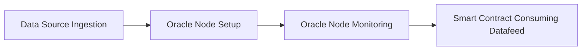

# Chainlink Sample Datafeed End-to-End Process

This repository contains quick example of Chainlink Datafeed End-to-End Process.

## Background

Chainlink is a decentralized oracle network that provides secure and reliable access to off-chain data for smart contracts. It bridges the gap between the blockchain and the real world, allowing smart contracts to access real-time data, such as price feeds, weather data, and sports scores. This enables the development of more complex and powerful DeFi applications, such as decentralized exchanges, lending protocols, and yield farming platforms.

Chainlink datafeeds are a key component of the Chainlink ecosystem, providing smart contracts with access to high-quality, tamper-proof data. They are used by a wide variety of DeFi applications, and they are essential for the growth and development of the DeFi ecosystem.

## Process

Step 1: Data Source Ingestion

Data from external sources is ingested by an external adapter that prepares the data for onboarding to Chainlink node. This data can come from a variety of sources, such as public APIs, databases, or IoT devices. 

Step 2: Oracle Node Setup

Chainlink oracle node is set up for validating and processing the data that is ingested into the Chainlink network. Oracle node running in the decentralized network can retrieve the data. 

Step 3: Oracle Node Monitoring

Monitoring is set up to collect health metrics from our Chainlink node. 

Step 4: Smart Contract Consuming Datafeed

Example smart contract can access the data that is provided by oracle node through Chainlink datafeed. 

## Stepwise Code Examples
- [Step 1: Data Source Ingestion](https://github.com/st-mn/chainlink-sample-datafeed-process-e2e/tree/main/1-chainlink-adapter-master/openweathermap_cl_ea-master)
- [Step 2: Oracle Node Setup](https://github.com/st-mn/chainlink-sample-datafeed-process-e2e/tree/main/2-chainlink-node-compose-master)
- [Step 3: Oracle Node Monitoring](https://github.com/st-mn/chainlink-sample-datafeed-process-e2e/tree/main/3-chainlink-node-metrics-master/chainlink-node-metrics-master)
- [Step 4: Smart Contract Consuming Datafeed](https://github.com/st-mn/chainlink-sample-datafeed-process-e2e/tree/main/4-chainlink-feed-sample-main)

## Technologies Used
- Solidity
- Chainlink
- Docker
- NodeJS

## Contributing

Contributions are welcome! If you have any ideas or improvements, please open an issue or submit a pull request.

## License

This project is licensed under the MIT License.

